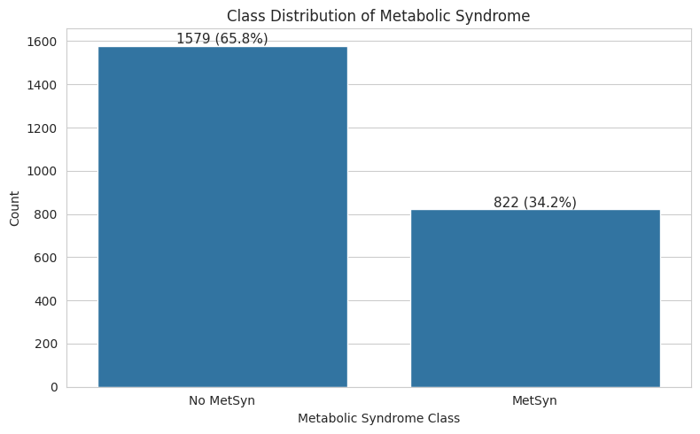
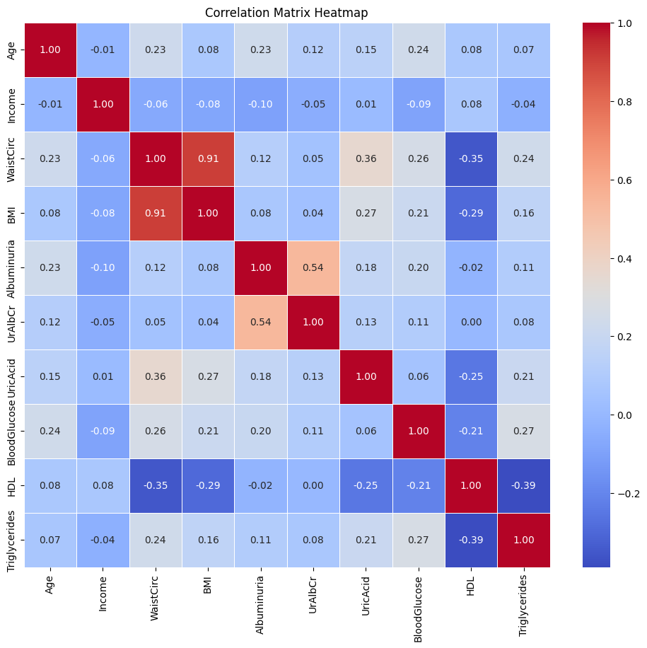
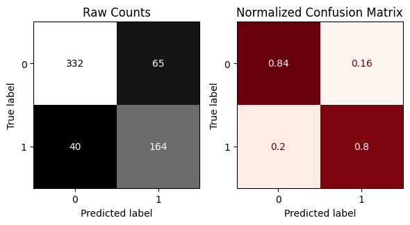
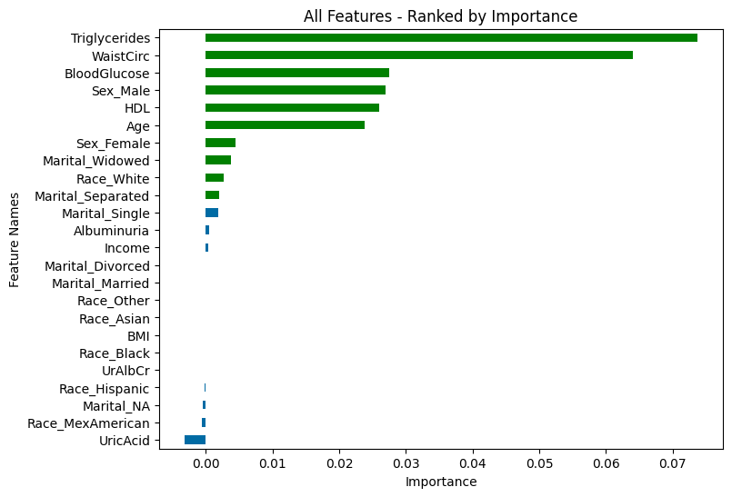
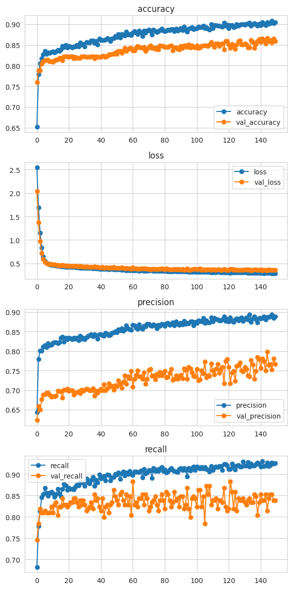

# Metabolic-Syndrome-Prediction

## Overview
This project builds and evaluates multiple machine learning and deep learning models to predict metabolic syndrome using health-related features derived from NHANES data.

The main goal of this project is not only to achieve good overall accuracy, but also to pay special attention to **recall for the positive class (MetSyn)**. In medical screening tasks, missing a true positive case can be more harmful than producing a false alarm. For that reason, recall was treated as an important evaluation metric throughout the project.

---

## Problem Statement
Metabolic syndrome is a cluster of conditions associated with increased risk of cardiovascular disease, diabetes, and other serious health complications. Early identification of individuals at risk can support preventive intervention and better clinical decision-making.

This project aims to classify whether a person has metabolic syndrome (`MetSyn`) or not (`No MetSyn`) using demographic and clinical variables.

---

## Dataset
The dataset used in this project was created from the **NHANES** initiative, with metabolic syndrome indicators combined from multiple tables.

The target variable is:

- `MetabolicSyndrome`
  - `No MetSyn`
  - `MetSyn`

The dataset includes a mixture of metabolic, clinical, and demographic predictors such as:

- Blood glucose
- Triglycerides
- Waist circumference
- HDL cholesterol
- BMI
- Age
- Uric acid
- Urine albumin/creatinine measures
- Income
- Sex
- Race
- Marital status

---

## Project Goals
The main goals of this project were:

1. Build baseline classification models for metabolic syndrome prediction.
2. Compare models using metrics beyond accuracy.
3. Prioritize **recall** because false negatives are especially costly in medical prediction.
4. Examine feature importance to understand which variables contribute most to the predictions.
5. Compare classical machine learning approaches with an artificial neural network (ANN).

---

## Why Recall Matters
In this project, particular attention is given to **recall** for the positive class.

Recall measures how many actual metabolic syndrome cases were correctly identified by the model. In a medical context, a false negative means that a person who may actually have metabolic syndrome is missed by the model. Because of that, recall is an especially meaningful metric for this task.

At the same time, recall was not viewed in isolation. Precision, F1-score, and overall accuracy were also used to understand the trade-offs between models.

---

## Data Preparation
The following preparation steps were applied:

- Set the ID column as index
- Checked for missing values and duplicates
- Examined data types and summary statistics
- Identified ordinal and categorical features
- Built preprocessing pipelines using:
  - imputation
  - scaling
  - one-hot encoding
- Split the data into training and test sets
- Transformed the train and test features using a preprocessing pipeline

---

## Exploratory Data Analysis
Exploratory analysis was performed to better understand the structure of the dataset and the relationships between variables.

Key observations included:

- The dataset showed a **moderate class imbalance**, with more `No MetSyn` samples than `MetSyn` samples.
- Several metabolic indicators were strongly associated with the target.
- A correlation analysis suggested multicollinearity between some variables, especially **BMI** and **Waist Circumference**.
- Because of this, feature importance analysis was used before deciding whether redundant features should be removed.

### Class Distribution


### Correlation Heatmap


### Relationship Between Blood Glucose and Metabolic Syndrome


### Relationship Between Triglycerides and Metabolic Syndrome


---

## Models Evaluated
The following models were trained and evaluated:

### 1. Random Forest
A tree-based ensemble model was trained and later tuned to improve performance.

### 2. Logistic Regression
Logistic Regression was used as a strong and interpretable baseline. It was tuned under different optimization goals, including recall-oriented and F1-oriented settings.

### 3. Artificial Neural Network (ANN)
A feedforward neural network was trained after balancing the training data with SMOTE. A tuned ANN experiment was also performed using Keras Tuner.

---

## Evaluation Metrics
The models were compared using:

- Accuracy
- Precision
- Recall
- F1-score
- Confusion matrices

Because this is a medical screening problem, the positive-class recall for `MetSyn` was one of the most important metrics in the final comparison.

---

## Final Model Comparison

| Model | Test Precision (MetSyn) | Test Recall (MetSyn) | Test F1 (MetSyn) | Test Accuracy | Interpretation |
|------|--------------------------:|---------------------:|-----------------:|--------------:|----------------|
| Tuned Random Forest | 0.84 | 0.76 | 0.80 | 0.87 | Strong overall performance, but recall is lower than the recall-focused logistic model |
| Tuned Logistic Regression (Recall-focused) | 0.64 | 0.82 | 0.72 | 0.78 | Best option when maximizing sensitivity is the main goal |
| Tuned Logistic Regression (F1-focused) | 0.72 | 0.80 | 0.76 | 0.83 | Best balanced and most interpretable final model |
| ANN Baseline | 0.77 | 0.75 | 0.76 | 0.84 | Competitive, but not clearly better than Logistic Regression |
| Tuned ANN | 0.46 | 0.81 | 0.59 | 0.62 | High recall, but too many false positives and weak overall balance |

---

## Best Model
The **best model for final presentation in this repository is the tuned Logistic Regression model optimized for F1-score**.

### Why this model was selected
It provided the best overall balance between:

- strong recall for identifying metabolic syndrome cases
- acceptable precision
- stable generalization on the test set
- interpretability compared with more complex models

Although the recall-focused Logistic Regression model achieved slightly higher recall, the F1-tuned Logistic Regression model gave a more balanced and cleaner final result for presentation.

### Final Model Confusion Matrix


### Recommended Interpretation
- If the goal is **medical screening** and minimizing missed cases is the top priority, the **recall-focused Logistic Regression** is a strong option.
- If the goal is **best overall final model for GitHub presentation**, the **F1-tuned Logistic Regression** is the best choice.

---

## Feature Importance Insights
Permutation importance analysis showed that the most influential features were primarily clinically meaningful metabolic markers.

The most consistently important predictors across the strongest models included:

- Triglycerides
- Waist Circumference
- Blood Glucose
- HDL
- Age

These findings are reasonable and support the medical relevance of the model.

An additional observation was that **BMI and Waist Circumference showed overlap**, and Waist Circumference often appeared more informative than BMI in the stronger models.

### Feature Importance of the Final Model


---

## PCA and Feature Engineering
Additional experiments were performed by introducing PCA components.

However, the PCA-enhanced versions did not produce a meaningful improvement over the original feature space. The confusion matrices and performance metrics remained very similar, suggesting that the original engineered predictors already captured most of the useful information.

---

## ANN Findings
A neural network was also trained to compare deep learning against classical models.

The baseline ANN performed reasonably well, but it did not clearly outperform the stronger Logistic Regression model on the held-out test set.

A tuned ANN variant achieved high recall, but this came at the cost of a large drop in precision and overall accuracy. Because of that, it was treated as an experimental high-recall model rather than the final recommended model.

### ANN Training History


---

## Limitations
This project has several limitations that are important to acknowledge:

1. The dataset contains a moderate class imbalance.
2. Some ANN experiments used SMOTE before internal validation splitting, which may make validation metrics appear slightly more optimistic than real-world performance.
3. The tuned ANN was not as stable or balanced as the best classical model.
4. This project is intended as a predictive modeling exercise and should not be interpreted as a clinical diagnostic tool.

---

## Conclusion
This project shows that relatively simple and interpretable models can perform very well for metabolic syndrome prediction.

Among all evaluated models, **tuned Logistic Regression** provided the strongest combination of recall, balance, and interpretability. The results also showed that clinically relevant metabolic indicators such as triglycerides, waist circumference, blood glucose, and HDL played the most important role in prediction.

Overall, this project highlights that model selection in healthcare-related tasks should be guided not only by accuracy, but also by the real-world cost of false negatives and false positives.

---

## Repository Structure
```bash
Metabolic-Syndrome-Prediction/
│
├── Metabolic_Syndrome_Prediction.ipynb
├── README.md
└── images/
    ├── Triglycerides vs metabolic.png
    ├── BloodGlucose vs metabolic.png
    ├── logreg_f1tuned_importance.png
    ├── logreg_tuned_importance.png
    ├── rf_tuned_importance.png
    ├── logreg_f1tuned_test.png
    ├── logreg_f1tuned_train.png
    ├── logreg_tuned_test.png
    ├── logreg_tuned_train.png
    ├── logreg_raw_test.png
    ├── logreg_raw_train.png
    ├── rf_tuned_test.png
    ├── rf_tuned_train.png
    ├── rf_raw_test.png
    ├── rf_raw_train.png
    ├── ANN.png
    ├── Correlation_heat_map.png
    └── Class_Distribution.png
